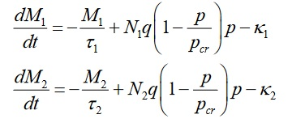
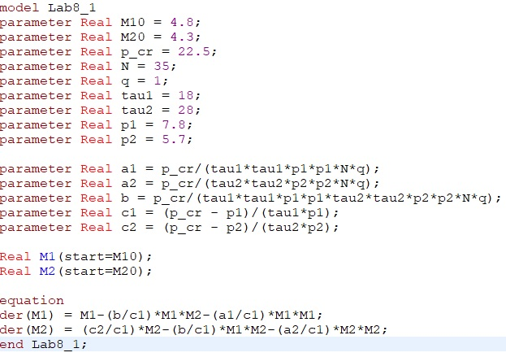
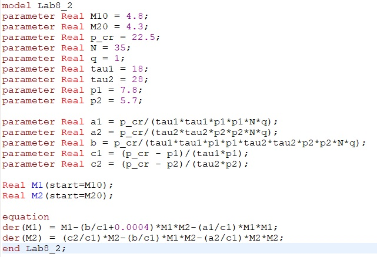

---
# Front matter
title: "Отчет по лабораторной работе 8"
subtitle: "Модель конкуренции двух фирм"
author: "Илья Валерьевич Фирстов"

# Generic otions
lang: ru-RU
toc-title: "Содержание"

# Bibliography
bibliography: bib/cite.bib
csl: pandoc/csl/gost-r-7-0-5-2008-numeric.csl

# Pdf output format
toc: true # Table of contents
toc_depth: 2
lof: true # List of figures
lot: true # List of tables
fontsize: 12pt
linestretch: 1.5
papersize: a4
documentclass: scrreprt
## I18n
polyglossia-lang:
  name: russian
  options:
	- spelling=modern
	- babelshorthands=true
polyglossia-otherlangs:
  name: english
### Fonts
mainfont: PTSerif-Regular.ttf
romanfont: PTSerif-Regular.ttf
sansfont: PTSerif-Regular.ttf
monofont: PTSerif-Regular.ttf
mainfontoptions: Ligatures=TeX
romanfontoptions: Ligatures=TeX
sansfontoptions: Ligatures=TeX,Scale=MatchLowercase
monofontoptions: Scale=MatchLowercase,Scale=0.9
## Biblatex
biblatex: true
biblio-style: "gost-numeric"
biblatexoptions:
  - parentracker=true
  - backend=biber
  - hyperref=auto
  - language=auto
  - autolang=other*
  - citestyle=gost-numeric
## Misc options
indent: true
header-includes:
  - \linepenalty=10 # the penalty added to the badness of each line within a paragraph (no associated penalty node) Increasing the value makes tex try to have fewer lines in the paragraph.
  - \interlinepenalty=0 # value of the penalty (node) added after each line of a paragraph.
  - \hyphenpenalty=50 # the penalty for line breaking at an automatically inserted hyphen
  - \exhyphenpenalty=50 # the penalty for line breaking at an explicit hyphen
  - \binoppenalty=700 # the penalty for breaking a line at a binary operator
  - \relpenalty=500 # the penalty for breaking a line at a relation
  - \clubpenalty=150 # extra penalty for breaking after first line of a paragraph
  - \widowpenalty=150 # extra penalty for breaking before last line of a paragraph
  - \displaywidowpenalty=50 # extra penalty for breaking before last line before a display math
  - \brokenpenalty=100 # extra penalty for page breaking after a hyphenated line
  - \predisplaypenalty=10000 # penalty for breaking before a display
  - \postdisplaypenalty=0 # penalty for breaking after a display
  - \floatingpenalty = 20000 # penalty for splitting an insertion (can only be split footnote in standard LaTeX)
  - \raggedbottom # or \flushbottom
  - \usepackage{float} # keep figures where there are in the text
  - \floatplacement{figure}{H} # keep figures where there are in the text
---

# Цель работы

Построить модель конкуренции

# Задание

Постройте графики изменения оборотных средств фирмы 1 и фирмы 2 без учета постоянных издержек и с веденной нормировкой для двух случаев.

# Теоретическое введение

Рассмотрим две фирмы, производящие взаимозаменяемые товары
одинакового качества и находящиеся в одной рыночной нише. Последнее означает,
что у потребителей в этой нише нет априорных предпочтений, и они приобретут
тот или иной товар, не обращая внимания на знак фирмы.
В этом случае, на рынке устанавливается единая цена, которая определяется
балансом суммарного предложения и спроса. Иными словами, в рамках нашей
модели конкурентная борьба ведётся только рыночными методами. То есть,
конкуренты могут влиять на противника путем изменения параметров своего
производства: себестоимость, время цикла, но не могут прямо вмешиваться в
ситуацию на рынке («назначать» цену или влиять на потребителей каким-
либо иным способом.)
Уравнения динамики оборотных средств запишем по аналогии с (2) в виде: 

{ #fig:005 width=70% }

где использованы те же обозначения, а индексы 1 и 2 относятся к первой и второй
фирме, соответственно. Величины N1 и N2 – числа потребителей, приобретших
товар первой и второй фирмы.

# Выполнение лабораторной работы

При выполнении я использовал общий шаблон кода, в котором изменял лишь функции, которые отличают частные случаи от общей модели.

Код 1 случая (рис. [-@fig:001])

{ #fig:001 width=70% }

График симуляции 1 случая (рис. [-@fig:002])

{ #fig:002 width=70% }

Код 2 случая (рис. [-@fig:003])

{ #fig:003 width=70% }

График симуляции 2 случая (рис. [-@fig:004])

{ #fig:004 width=70% }

# Выводы

Я построил графики изменения оборотных средств фирмы 1 и фирмы 2 без учета постоянных издержек и с веденной нормировкой для двух случаев.

# Список литературы{.unnumbered}

::: {#refs}
:::
