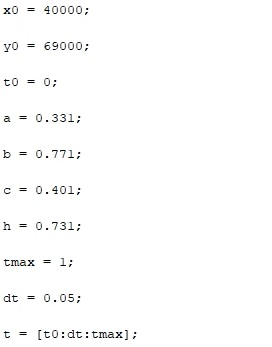
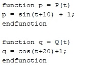
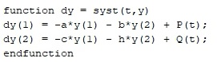
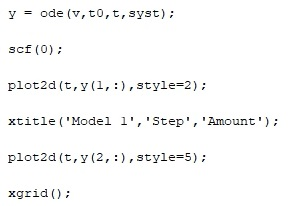

---
## Front matter
lang: ru-RU
title: Structural approach to the deep learning method
author: |
	Leonid A. Sevastianov\inst{1,3}
	\and
	Anton L. Sevastianov\inst{1}
	\and
	Edik A. Ayrjan\inst{2}
	\and
	Anna V. Korolkova\inst{1}
	\and
	Dmitry S. Kulyabov\inst{1,2}
	\and
	Imrikh Pokorny\inst{4}
institute: |
	\inst{1}RUDN University, Moscow, Russian Federation
	\and
	\inst{2}LIT JINR, Dubna, Russian Federation
	\and
	\inst{3}BLTP JINR, Dubna, Russian Federation
	\and
	\inst{4}Technical University of Košice, Košice, Slovakia
date: NEC--2019, 30 September -- 4 October, 2019 Budva, Montenegro

## Formatting
toc: false
slide_level: 2
theme: metropolis
header-includes: 
 - \metroset{progressbar=frametitle,sectionpage=progressbar,numbering=fraction}
 - '\makeatletter'
 - '\beamer@ignorenonframefalse'
 - '\makeatother'
aspectratio: 43
section-titles: true
---

# Теория

## Что такое уравнение Ланчестера

В 1916 году английский математик Фредерик Уильям Ланчестер (1868–1945) предложил систему из двух однородных дифференциальных уравнений для моделирования воздушного боя. Справедливости ради следует отметить, что за год до него подобную модель опубликовал русский математик М. П. Осипов (1915а; 1915б). Но, как обычно происходит в подобных случаях, в литературе для серии подобных моделей утвердился термин «ланчестерские».

В наиболее общем виде ланчестерские модели можно описать уравнением:

{ #fig:001 width=70% }

Частные случаи можно разделить на три вида:
1. Боевые действия между регулярными войсками
2. Боевые действия с участием регулярных войск и партизанских
отрядов
3. Боевые действия между партизанскими отрядами

В этих случаях уравнение будет изменяться:

{ #fig:002 width=70% }

# Практика

## Решение задачи

Рассмотрим решение задачи на примере приведенных в лабораторной условий.

Для начала вводим начальные коэффициенты (рис. [-@fig:002])
{ #fig:002 width=70% }

После этого вводим функции P и Q(рис. [-@fig:003])
{ #fig:003 width=70% }

Затем вводим уравнения Ланчестера(рис. [-@fig:004])
{ #fig:004 width=70% }

При помощи функции ode решаем дифференциальные уравнения и рисуем график(рис. [-@fig:005])
{ #fig:005 width=70% }

График первого уравнения выглядит так(рис. [-@fig:006])
{ #fig:006 width=70% }

После этого для второй модели переопределим коэффициенты и функции P и Q(рис. [-@fig:007])
{ #fig:007 width=70% }

Решаем аналогично предыдущей модели, получаем другой график решения(рис. [-@fig:008])
{ #fig:008 width=70% }
