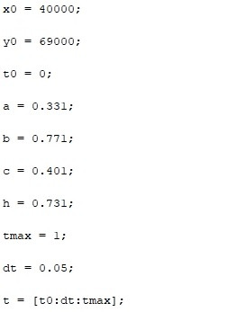
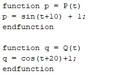
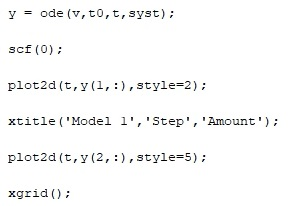
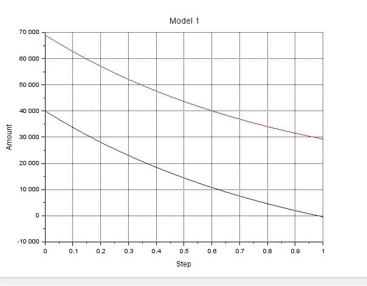
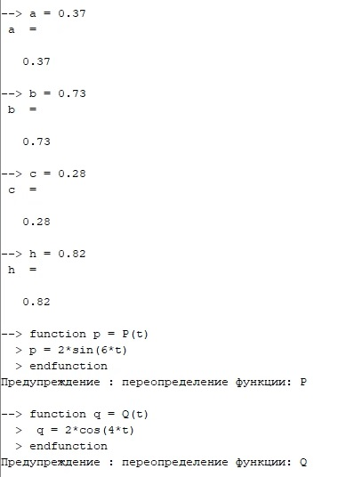
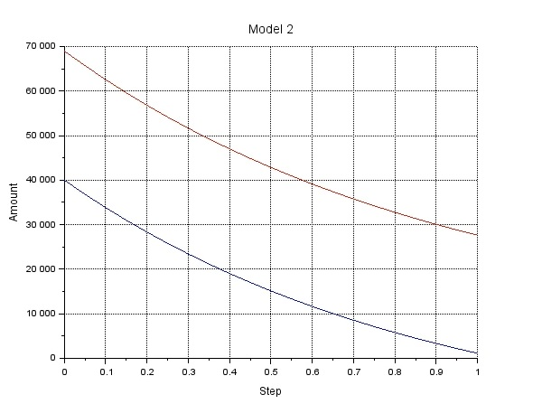

---
# Front matter
title: "Шаблон отчёта по лабораторной работе"
subtitle: "Простейший вариант"
author: "Дмитрий Сергеевич Кулябов"

# Generic otions
lang: ru-RU
toc-title: "Содержание"

# Bibliography
bibliography: bib/cite.bib
csl: pandoc/csl/gost-r-7-0-5-2008-numeric.csl

# Pdf output format
toc: true # Table of contents
toc_depth: 2
lof: true # List of figures
lot: true # List of tables
fontsize: 12pt
linestretch: 1.5
papersize: a4
documentclass: scrreprt
## I18n
polyglossia-lang:
  name: russian
  options:
	- spelling=modern
	- babelshorthands=true
polyglossia-otherlangs:
  name: english
### Fonts
mainfont: PT Serif
romanfont: PT Serif
sansfont: PT Sans
monofont: PT Mono
mainfontoptions: Ligatures=TeX
romanfontoptions: Ligatures=TeX
sansfontoptions: Ligatures=TeX,Scale=MatchLowercase
monofontoptions: Scale=MatchLowercase,Scale=0.9
## Biblatex
biblatex: true
biblio-style: "gost-numeric"
biblatexoptions:
  - parentracker=true
  - backend=biber
  - hyperref=auto
  - language=auto
  - autolang=other*
  - citestyle=gost-numeric
## Misc options
indent: true
header-includes:
  - \linepenalty=10 # the penalty added to the badness of each line within a paragraph (no associated penalty node) Increasing the value makes tex try to have fewer lines in the paragraph.
  - \interlinepenalty=0 # value of the penalty (node) added after each line of a paragraph.
  - \hyphenpenalty=50 # the penalty for line breaking at an automatically inserted hyphen
  - \exhyphenpenalty=50 # the penalty for line breaking at an explicit hyphen
  - \binoppenalty=700 # the penalty for breaking a line at a binary operator
  - \relpenalty=500 # the penalty for breaking a line at a relation
  - \clubpenalty=150 # extra penalty for breaking after first line of a paragraph
  - \widowpenalty=150 # extra penalty for breaking before last line of a paragraph
  - \displaywidowpenalty=50 # extra penalty for breaking before last line before a display math
  - \brokenpenalty=100 # extra penalty for page breaking after a hyphenated line
  - \predisplaypenalty=10000 # penalty for breaking before a display
  - \postdisplaypenalty=0 # penalty for breaking after a display
  - \floatingpenalty = 20000 # penalty for splitting an insertion (can only be split footnote in standard LaTeX)
  - \raggedbottom # or \flushbottom
  - \usepackage{float} # keep figures where there are in the text
  - \floatplacement{figure}{H} # keep figures where there are in the text
---

# Цель работы

Построить модель боевых действий Ланчестера в двух случаях.

# Задание

# Теоретическое введение

Уравнения Ланчестера — это дифференциальные уравнения, описывающие зависимость между силами сражающихся сторон X и Y как функцию от времени, причем функция зависит только от X и Y. 
В 1916 году, в разгар первой мировой войны, Фредерик Ланчестер разработал систему дифференциальных уравнений для демонстрации соотношения между противостоящими силами. Среди них есть так называемые Линейные законы Ланчестера.
В общем виде уравнение представляется так:
{ #fig:001 width=70% }

# Выполнение лабораторной работы

Для начала вводим начальные коэффициенты (рис. [-@fig:002])
{ #fig:002 width=70% }

После этого вводим функции P и Q(рис. [-@fig:003])
{ #fig:003 width=70% }

Затем вводим уравнения Ланчестера(рис. [-@fig:004])
{ #fig:004 width=70% }

При помощи функции ode решаем дифференциальные уравнения и рисуем график(рис. [-@fig:005])
{ #fig:005 width=70% }

График первого уравнения выглядит так(рис. [-@fig:006])
{ #fig:006 width=70% }

После этого для второй модели переопределим коэффициенты и функции P и Q(рис. [-@fig:007])
{ #fig:007 width=70% }

Решаем аналогично предыдущей модели, получаем другой график решения(рис. [-@fig:008])
{ #fig:008 width=70% }

# Выводы

Я ознакомился с работой уравнения Ланчестера и применил их в двух случаях.

# Список литературы{.unnumbered}

::: {#refs}
:::
