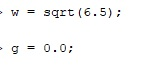
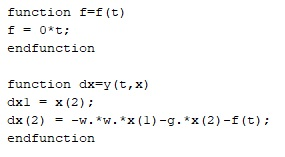
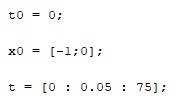
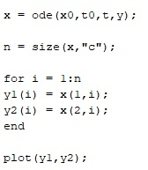
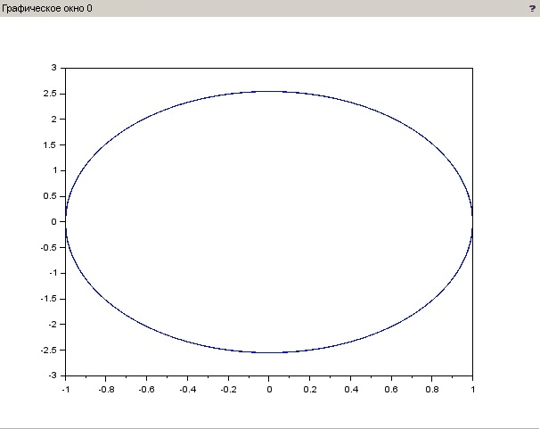
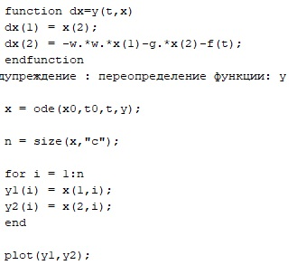
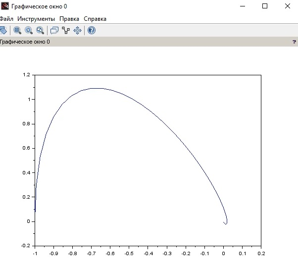
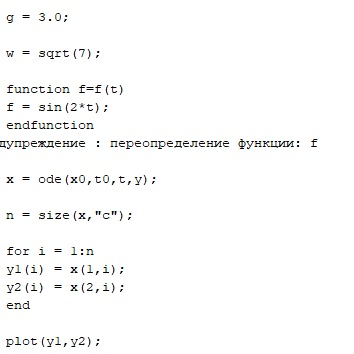
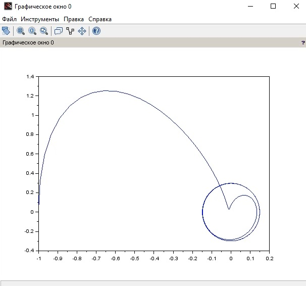

---
## Front matter
lang: ru-RU
title: Structural approach to the deep learning method
author: |
	Leonid A. Sevastianov\inst{1,3}
	\and
	Anton L. Sevastianov\inst{1}
	\and
	Edik A. Ayrjan\inst{2}
	\and
	Anna V. Korolkova\inst{1}
	\and
	Dmitry S. Kulyabov\inst{1,2}
	\and
	Imrikh Pokorny\inst{4}
institute: |
	\inst{1}RUDN University, Moscow, Russian Federation
	\and
	\inst{2}LIT JINR, Dubna, Russian Federation
	\and
	\inst{3}BLTP JINR, Dubna, Russian Federation
	\and
	\inst{4}Technical University of Košice, Košice, Slovakia
date: NEC--2019, 30 September -- 4 October, 2019 Budva, Montenegro

## Formatting
toc: false
slide_level: 2
theme: metropolis
header-includes: 
 - \metroset{progressbar=frametitle,sectionpage=progressbar,numbering=fraction}
 - '\makeatletter'
 - '\beamer@ignorenonframefalse'
 - '\makeatother'
aspectratio: 43
section-titles: true
---

# Теоретическая справка

Движение грузика на пружинке, маятника, заряда в электрическом контуре, а
также эволюция во времени многих систем в физике, химии, биологии и других
науках при определенных предположениях можно описать одним и тем же
дифференциальным уравнением, которое в теории колебаний выступает в качестве
основной модели. Эта модель называется линейным гармоническим осциллятором.

Значение фазовых координат x, y в любой момент времени полностью
определяет состояние системы. Решению уравнения движения как функции
времени отвечает гладкая кривая в фазовой плоскости. Она называется фазовой
траекторией. Если множество различных решений (соответствующих различным
начальным условиям) изобразить на одной фазовой плоскости, возникает общая
картина поведения системы. Такую картину, образованную набором фазовых
траекторий, называют фазовым портретом.

# Выполнение лабораторной работы

Ниже приведены шаги выполнения лабораторной работы, в соответствии с 13 вариантом из приведенного документа.

Ввел начальные условия для 1 случая (рис. [-@fig:001])

{ #fig:001 width=70% }

Ввел левую и правую часть уравнения для 1 случая (рис. [-@fig:002])

{ #fig:002 width=70% }

Ввел начальную точку для 1 случая (рис. [-@fig:003])

{ #fig:003 width=70% }

Решил уравнение и построил график для 1 случая (рис. [-@fig:004])

{ #fig:004 width=70% }

Фазовый портрет для 1 случая (рис. [-@fig:005])

{ #fig:005 width=70% }

Затем для 2 случая переопределил начальные условия, после чего снова решил уравнение и построил график(рис. [-@fig:006])

{ #fig:006 width=70% }

Фазовый портрет для 2 случая (рис. [-@fig:009])

{ #fig:009 width=70% }

Затем для 3 случая переопределил начальные условия, после чего снова решил уравнение и построил график(рис. [-@fig:007])

{ #fig:007 width=70% }

Фазовый портрет для 3 случая (рис. [-@fig:010])

{ #fig:010 width=70% }

## {.standout}

Wer's nicht glaubt, bezahlt einen Taler
