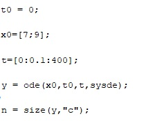

---
## Front matter
lang: ru-RU
title: 
author: |

institute: |

date: 

## Formatting
toc: false
slide_level: 2
theme: metropolis
header-includes: 

 - '\makeatletter'

 - '\makeatother'
aspectratio: 43
section-titles: true

# Теоретическая справка

Простейшая модель взаимодействия двух видов типа «хищник — жертва» -
модель Лотки-Вольтерры. Данная двувидовая модель основывается на
следующих предположениях:
1. Численность популяции жертв x и хищников y зависят только от времени
(модель не учитывает пространственное распределение популяции на
занимаемой территории)
2. В отсутствии взаимодействия численность видов изменяется по модели
Мальтуса, при этом число жертв увеличивается, а число хищников падает
3. Естественная смертность жертвы и естественная рождаемость хищника
считаются несущественными
4. Эффект насыщения численности обеих популяций не учитывается
5. Скорость роста численности жертв уменьшается пропорционально
численности хищников

В этой модели x – число жертв, y - число хищников. Коэффициент a
описывает скорость естественного прироста числа жертв в отсутствие хищников, с
- естественное вымирание хищников, лишенных пищи в виде жертв. Вероятность
взаимодействия жертвы и хищника считается пропорциональной как количеству
жертв, так и числу самих хищников (xy). Каждый акт взаимодействия уменьшает
популяцию жертв, но способствует увеличению популяции хищников (члены -bxy
и dxy в правой части уравнения).

# Выполнение лабораторной работы

Ниже приведены шаги выполнения лабораторной работы, в соответствии с 13 вариантом из приведенного документа.

Ввел коэффиценты (рис. [-@fig:001])

{ #fig:001 width=70% }

Ввел дифференциальное уравнение (рис. [-@fig:002])

{ #fig:002 width=70% }

Построил графики (рис. [-@fig:003])

{ #fig:003 width=70% }

График зависимости численности хищников от численности жертв (рис. [-@fig:004])

{ #fig:004 width=70% }

График изменения численности хищников (рис. [-@fig:005])

{ #fig:005 width=70% }

График изменения численности хищников жертв(рис. [-@fig:006])

{ #fig:006 width=70% }

## {.standout}

Wer's nicht glaubt, bezahlt einen Taler
